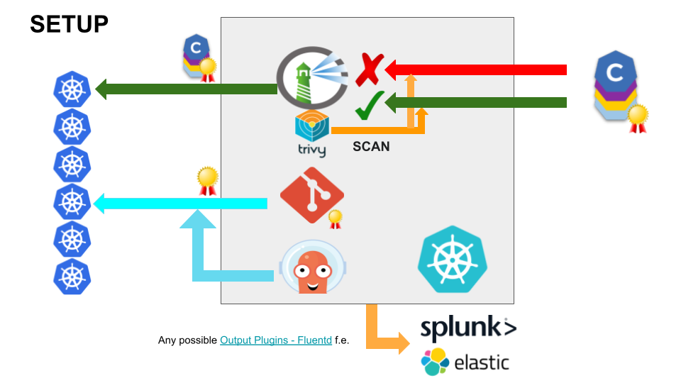

# notebooks-management-cluster
All Jupyter notebooks to create a management cluster

Tested with Minikube and CRC

1. Start with storage to add persistence
2. Deploy Harbor
3. Deploy Gitea
4. Deploy Argo
